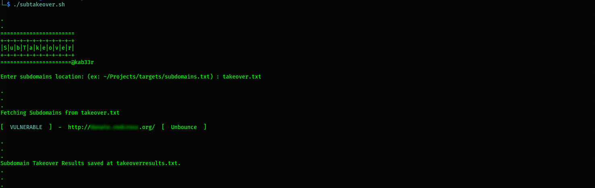
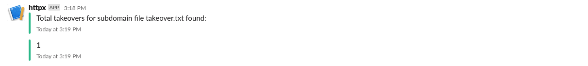

# subtakeover
Bash Subdomain Takeover automation using Subzy and notify the results on your Slack/Discord.

# Usage
`$./subtakeover.sh`

# Features
- Check for subdomain takeovers for input subdomain file location.
- Creates a text file for only positive results.
- Updates you in notify with number of unique takeovers found.

# Installation
   * `git clone https://github.com/kab33r/subtakeover`
   * `cd subtakeover`
   * `chmod +x subtakeover.sh`

# Make sure to install the tools
   * Notify https://github.com/projectdiscovery/notify
   * Subzy https://github.com/LukaSikic/subzy
